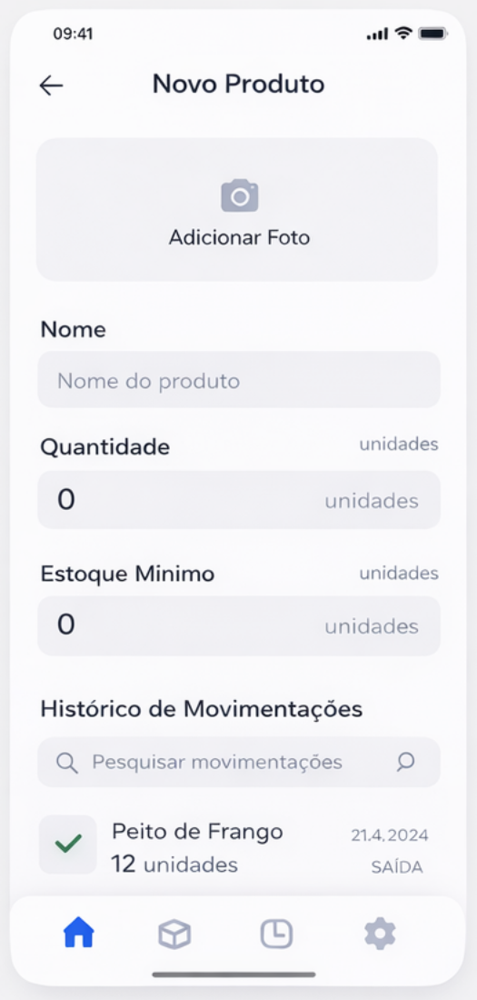
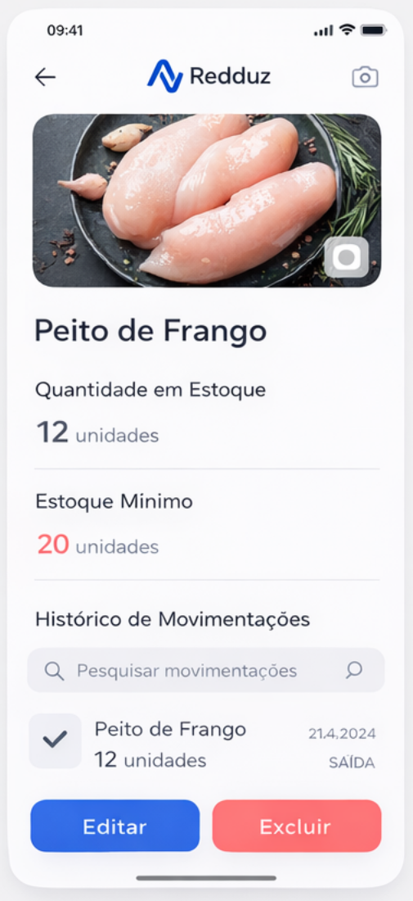

<div align="center">

# Redduz

### Controle de estoque simples e visual para cozinhas e restaurantes


<br>


</div>

---

## Sobre o projeto

O **Redduz** é uma aplicação **full stack** de gestão de estoque voltada para **cozinhas profissionais, restaurantes e estabelecimentos de alimentação**.

A ideia nasceu de uma necessidade real observada no dia a dia de uma cozinha, em parceria com uma amiga da área de nutrição e alimentação: **conhecimento do negócio + tecnologia**. Em vez de depender de planilhas e anotações espalhadas, o Redduz centraliza tudo em uma interface simples, pensada para o celular.

> **"O que eu tenho no estoque, o que está acabando e o que aconteceu recentemente?"**

O Redduz responde a essa pergunta em poucos segundos.

---

## Telas

<div align="center">

| Tela Inicial | Novo Produto | Detalhes do Produto |
|:---:|:---:|:---:|
|  |  |  |
| Resumo do estoque, alertas e movimentações recentes | Cadastro com foto, quantidade e estoque mínimo | Informações do produto, histórico e ações de editar/excluir |

</div>

> As imagens acima fazem parte do protótipo de design do projeto. Veja a seção [Status do projeto](#status-do-projeto) para saber o que já está implementado.

---

## Funcionalidades

- **Painel inicial** com total de produtos cadastrados
- **Alertas de estoque baixo** para produtos abaixo do mínimo
- **Entradas e saídas** de produtos
- **Histórico de movimentações** com data, tipo e quantidade
- **Busca** de movimentações por nome do produto
- **Cadastro de produtos** com foto, quantidade e estoque mínimo
- **Interface mobile-first**, ideal para uso dentro da cozinha

---

## Como funciona

```text
Compra de produtos
        ↓
ENTRADA no estoque
        ↓
Utilização na cozinha
        ↓
SAÍDA do estoque
        ↓
Estoque atualizado + alerta se estiver abaixo do mínimo
```

---

## Arquitetura

```text
┌──────────────────────┐        HTTP / JSON        ┌──────────────────────┐
│       FRONTEND       │  ───────────────────────► │       BACKEND        │
│  React + TypeScript  │           Axios           │  FastAPI (API REST)  │
│  Vite + Tailwind CSS │  ◄─────────────────────── │  Python + SQLAlchemy │
└──────────────────────┘                           └──────────┬───────────┘
                                                              │
                                                       ┌──────▼───────┐
                                                       │    Banco     │
                                                       │   de dados   │
                                                       └──────────────┘
```

### Tecnologias

| Camada | Tecnologias |
|---|---|
| **Frontend** | React, TypeScript, Vite, Tailwind CSS, Lucide React, Axios |
| **Backend** | Python, FastAPI, SQLAlchemy |
| **Comunicação** | API REST, JSON, CORS |

### Endpoints principais

| Método | Rota | Descrição |
|---|---|---|
| `GET` | `/estoque/produtos` | Lista os produtos cadastrados |
| `GET` | `/estoque/alertas` | Lista produtos abaixo do estoque mínimo |
| `GET` | `/estoque/movimentacoes` | Lista as movimentações |
| `GET` | `/estoque/movimentacoes?nome_produto=Arroz` | Filtra movimentações por produto |

### Modelo de dados

```typescript
interface Movement {
  id: number;
  produto_id: number;
  produto: string;
  tipo: "ENTRADA" | "SAIDA";
  quantidade: number;
  data: string;
}
```

---

## Estrutura do frontend

```text
FrontEnd/
├── src/
│   ├── components/
│   │   ├── Header.tsx
│   │   ├── StatusCard.tsx
│   │   ├── MovementItem.tsx
│   │   ├── SearchInput.tsx
│   │   ├── BottomNavigation.tsx
│   │   └── MobileContainer.tsx
│   ├── pages/
│   │   └── Home.tsx
│   ├── services/
│   │   ├── api.ts
│   │   ├── products.service.ts
│   │   └── movements.service.ts
│   ├── types/
│   │   └── Movement.ts
│   ├── App.tsx
│   ├── main.tsx
│   └── index.css
├── package.json
└── vite.config.ts
```

---

## Como executar

### Pré-requisitos

- [Node.js](https://nodejs.org/) 18+
- [Python](https://www.python.org/) 3.10+

### Backend

```bash
cd REDDUZ/BackEnd

# criar e ativar o ambiente virtual
python -m venv venv
source venv/bin/activate      # Linux/Mac
venv\Scripts\activate         # Windows

# instalar dependências
pip install -r requirements.txt

# iniciar a API
uvicorn main:app --reload
```

A API ficará disponível em `http://localhost:8000` e a documentação interativa em `http://localhost:8000/docs`.

### Frontend

```bash
cd REDDUZ/FrontEnd
npm install
npm run dev
```

A aplicação ficará disponível em `http://localhost:5173`.

> Ajuste os nomes das pastas e o comando do `uvicorn` conforme a estrutura real do seu repositório.

---

## Status do projeto

### Implementado

- [x] Tela inicial consumindo dados reais da API
- [x] Card de produtos cadastrados
- [x] Card de alertas de estoque baixo
- [x] Lista de movimentações recentes
- [x] Busca de movimentações por produto
- [x] Componentização e camada de serviços no frontend

### Em desenvolvimento / Roadmap

- [ ] Tela de cadastro de novo produto
- [ ] Tela de detalhes do produto (editar e excluir)
- [ ] Upload de foto do produto
- [ ] Autenticação de usuários e perfis
- [ ] Dashboard e relatórios
- [ ] Categorias e fornecedores
- [ ] Notificações
- [ ] Registro de movimentações por **texto, voz ou foto**

---

## Autor

**Claudio**

[](https://github.com/SEU-USUARIO)
[](https://linkedin.com/in/SEU-USUARIO)

---

<div align="center">

Feito com dedicação para facilitar a rotina de quem trabalha na cozinha.

</div>

